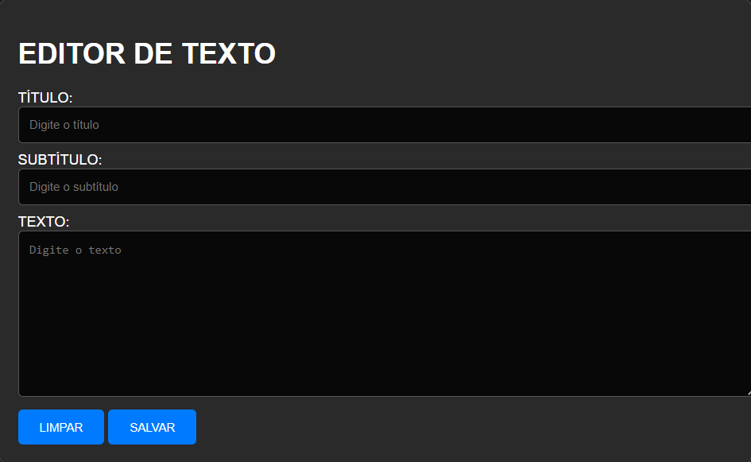

# WORD BASICO
🔐SALVE O SEU TEXTO EM UM ARQUIVO TXT! 

  

## DESCRIÇÃO:
O "WORD BÁSICO" é um editor de texto simples que permite aos usuários escrever um título, um subtítulo e um texto. Aqui estão as principais funcionalidades implementadas:

1. **Editor de Texto Simples:**
   - Os usuários podem inserir um título, um subtítulo e um texto no editor de texto fornecido.

2. **Limpar Campos:**
   - O botão "LIMPAR" permite ao usuário limpar todos os campos do editor, facilitando a entrada de novos conteúdos.

3. **Salvar Documento de Texto:**
   - Ao clicar em "SALVAR", o conteúdo inserido é combinado em um documento de texto simples.
   - Um arquivo de texto contendo o título, subtítulo e texto é gerado e baixado automaticamente com o nome "documento.txt".

## EXECUTANDO O PROJETO:
1. **Inserir Conteúdo:**
   - Insira um título, um subtítulo e um texto nos campos correspondentes do editor de texto.

2. **Limpar Campos:**
   - Se desejar limpar todos os campos e recomeçar, clique no botão "LIMPAR".

3. **Salvar Documento:**
   - Após inserir o conteúdo desejado, clique em "SALVAR" para baixar o documento de texto contendo o título, subtítulo e texto inseridos.

## NÃO SABE?
- Entendemos que para manipular arquivos em `HTML`, `CSS` e outras linguagens relacionadas, é necessário possuir conhecimento nessas áreas. Para auxiliar nesse aprendizado, oferecemos cursos gratuitos disponíveis:
* [CURSO DE HTML E CSS](https://github.com/VILHALVA/CURSO-DE-HTML-E-CSS)
* [CURSO DE JAVASCRIPT](https://github.com/VILHALVA/CURSO-DE-JAVASCRIPT)
* [CONFIRA MAIS CURSOS](https://github.com/VILHALVA?tab=repositories&q=+topic:CURSO)

## CREDITOS:
- [PROJETO CRIADO PELO VILHALVA](https://github.com/VILHALVA)
- [ESTÁ DISPONIVEL NO SITE](https://vilhalva.github.io/STYLER/STYLER.html)

